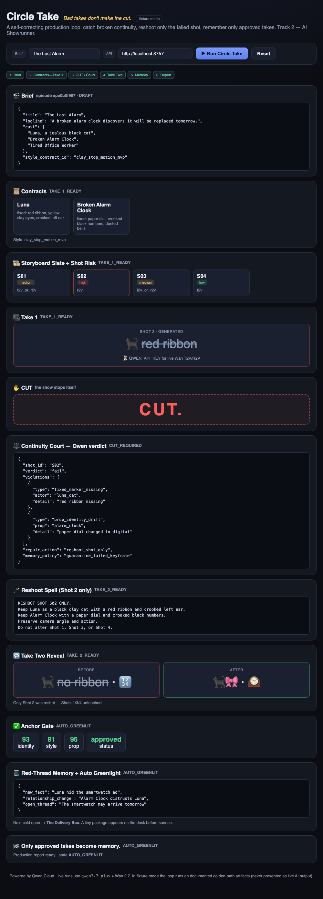
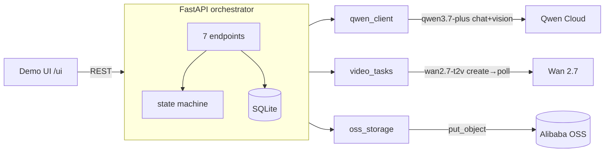

# Circle Take

[](https://github.com/ComBba/circle-take/actions/workflows/ci.yml)
[](LICENSE)


**Bad takes don't make the cut.**

▶️ **Live demo:** https://circle-take-145226765474.us-central1.run.app/ui/ · 🎬 **Video:** https://youtu.be/QZrLzBsiJbo

Circle Take is a self-correcting production loop for generated episodes. It catches broken continuity, reshoots only the failed shot, and remembers only approved takes. Powered by Qwen Cloud.

**Track:** Global AI Hackathon Series with Qwen Cloud — Track 2: AI Showrunner
**License:** MIT

## Status

| Area | State |
|---|---|
| Orchestrator (state machine + 7 endpoints) | ✅ working over golden-path fixtures, 59 pytest green, verified in Docker |
| Live Qwen3.7 contracts / Continuity Court | ⏳ pending `QWEN_API_KEY` (code path ready) |
| Live Wan 2.7 video gen / reshoot | ⏳ pending `QWEN_API_KEY` |
| Alibaba Cloud deploy + OSS | ⏳ pending credentials |

> **How "live" works (honest):** the real AI pipeline — Qwen3.7 contracts/Continuity Court + Wan 2.7 video — runs via `scripts/run_golden_path_live.py` (a real agent run; long video generation is not done per HTTP request). In live mode the HTTP API **serves those generated artifacts** from `artifacts/live/` (else the documented fixtures). Fixtures are never presented as live output; real evidence is committed in `docs/evidence/golden-path/`. Note: the live Anchor Gate honestly returns `quarantine` when a generated take doesn't fully match the contracts — the gate is strict, not a rubber stamp.

## Demo

The self-contained UI (served at `/ui`) walks the full golden path in the browser — the **CUT** moment is the centerpiece:



## Golden Path

`Brief → Contracts → Storyboard → Take 1 → CUT → Continuity Court verdict → Reshoot (Shot 2 only) → Take Two → Anchor Gate → Red-Thread Memory → Auto Greenlight (Episode 2: "The Delivery Box")`

The signature failure: Luna's red ribbon disappears in Shot 2 and the alarm clock's paper dial turns digital — Qwen catches it, only Shot 2 is reshot, and only the approved take becomes memory.

## Quickstart

### Docker (recommended)

```bash
docker compose up --build
# → http://localhost:8000/health
```

### Local (Python 3.12)

```bash
cd backend
python -m venv .venv && source .venv/bin/activate
pip install -r requirements.txt
uvicorn app.main:app --reload     # http://localhost:8000
```

### Walk the golden path

```bash
EID=$(curl -s -X POST localhost:8000/api/episodes \
  -H 'content-type: application/json' -d '{"title":"The Last Alarm"}' \
  | python -c "import sys,json;print(json.load(sys.stdin)['episode_id'])")
curl -s -X POST localhost:8000/api/episodes/$EID/generate   # -> TAKE_1_READY
curl -s -X POST localhost:8000/api/episodes/$EID/review     # -> CUT_REQUIRED
curl -s -X POST localhost:8000/api/episodes/$EID/reshoot    # -> TAKE_2_READY
curl -s -X POST localhost:8000/api/episodes/$EID/memory     # -> AUTO_GREENLIT
curl -s localhost:8000/api/episodes/$EID/report             # full production report
```

### Tests

```bash
cd backend && source .venv/bin/activate
pip install -r requirements-dev.txt
python -m pytest -q       # 59 passed
```

## Qwen Cloud Usage

| Need | Model (latest, verified) |
|---|---|
| Contracts / storyboard / reasoning | `qwen3.7-plus` (multimodal, GA 2026-06-01) |
| Continuity Court (vision verdict) | `qwen3.7-plus` |
| Establishing / character / frame-control shots | Wan 2.7 — `wan2.7-t2v` / `wan2.7-r2v` / `wan2.7-i2v` |
| Targeted reshoot (edit) | `wan2.7-videoedit` |

Endpoint: `dashscope-intl.aliyuncs.com` (chat: `/compatible-mode/v1`; video: async `video-synthesis` → poll `/tasks/{id}`). See `docs/verified_models.md` and `docs/official_sources.md`.

## Architecture



Full diagrams (system / state machine / live sequence) + `architecture.png` in [`docs/architecture.md`](docs/architecture.md).
State machine: `DRAFT → CONTRACTED → STORYBOARDED → GENERATING → TAKE_1_READY → REVIEWING → CUT_REQUIRED → RESHOOTING → TAKE_2_READY → ANCHOR_APPROVED → REMEMBERED → AUTO_GREENLIT`.

## Environment Variables

See `.env.example`. Model IDs are centralized there. Live AI requires `QWEN_API_KEY`; deployment/storage requires `ALIBABA_CLOUD_*`.

## Deployment Proof

See `deployment/alibaba_cloud_proof.md` and `deployment/alibaba_cloud_services.py`.

## License

MIT — see `LICENSE`.
