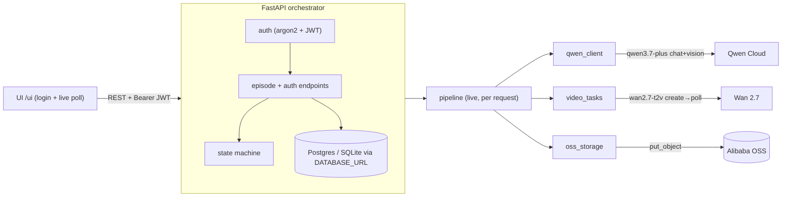

# Circle Take

[](https://github.com/ComBba/circle-take/actions/workflows/ci.yml)
[](LICENSE)


**Bad takes don't make the cut.**

▶️ **Live demo:** https://circle-take-145226765474.us-central1.run.app/ui/ · 🎬 **Video:** https://youtu.be/QZrLzBsiJbo

Circle Take is a self-correcting production loop for generated episodes. It catches broken continuity, reshoots only the failed shot, and remembers only approved takes. Powered by Qwen Cloud.

**Track:** Global AI Hackathon Series with Qwen Cloud — Track 2: AI Showrunner
**License:** MIT

## Status

An operational multi-user platform, not just a demo: sign up with email, and each
episode runs the **real** Qwen3.7 + Wan 2.7 pipeline per request, scoped to you.

| Area | State |
|---|---|
| Orchestrator (state machine + endpoints) | ✅ 87 pytest green, verified in Docker |
| Email + password auth (JWT), per-user episodes | ✅ register/login, argon2, bearer-protected |
| Live Qwen3.7 contracts / Continuity Court (per request) | ✅ real Qwen-vision verdict from the generated frame |
| Live Wan 2.7 video gen / reshoot (async per request) | ✅ create→poll, mp4 mirrored to Alibaba OSS |
| Persistence | ✅ SQLAlchemy + `DATABASE_URL` (SQLite local, Postgres prod) |
| Deploy (Cloud Run + Cloud SQL Postgres) | ✅ `deployment/cloud_run_deploy.md` |

> **How "live" works (honest):** with `APP_ENV=live`, each authenticated episode makes
> **real per-request calls** — Qwen3.7 generates the contracts/storyboard, Wan 2.7 renders
> Take 1/Take 2 (async, 1–5 min, polled via `/take/{n}/poll`), and Qwen3.7-vision judges the
> actual generated frame in the Continuity Court. Nothing is staged: the verdict comes from the
> real frame, and the Anchor Gate returns `quarantine` when a take doesn't match the contracts —
> the gate is strict, not a rubber stamp. `APP_ENV=fixture` runs the same loop over golden-path
> artifacts for a deterministic, key-free demo (never presented as live output).

## Demo

The self-contained UI (served at `/ui`) walks the full golden path in the browser — the **CUT** moment is the centerpiece:


## Golden Path

`Brief → Contracts → Storyboard → Take 1 → CUT → Continuity Court verdict → Reshoot (Shot 2 only) → Take Two → Anchor Gate → Red-Thread Memory → Auto Greenlight (Episode 2: "The Delivery Box")`

The signature failure: Luna's red ribbon disappears in Shot 2 and the alarm clock's paper dial turns digital — Qwen catches it, only Shot 2 is reshot, and only the approved take becomes memory.

## Quickstart

### Docker (recommended)

```bash
docker compose up --build
# → http://localhost:8000/health
```

### Local (Python 3.12)

```bash
cd backend
python -m venv .venv && source .venv/bin/activate
pip install -r requirements.txt
uvicorn app.main:app --reload     # http://localhost:8000
```

### Walk the golden path (auth required)

```bash
B=http://localhost:8000
# 1) sign up -> JWT
TOK=$(curl -s -X POST $B/api/auth/register -H 'content-type: application/json' \
  -d '{"email":"you@example.com","password":"password123"}' \
  | python -c "import sys,json;print(json.load(sys.stdin)['access_token'])")
H="Authorization: Bearer $TOK"
# 2) per-user episode (every /api/episodes* requires the token; 401 otherwise)
EID=$(curl -s -X POST $B/api/episodes -H "$H" -H 'content-type: application/json' \
  -d '{"title":"The Last Alarm"}' | python -c "import sys,json;print(json.load(sys.stdin)['episode_id'])")
curl -s -X POST $B/api/episodes/$EID/generate -H "$H"   # -> TAKE_1_READY (live: starts Wan Take 1)
# live mode: poll until take_1.status == succeeded
curl -s -X POST $B/api/episodes/$EID/take/1/poll -H "$H"
curl -s -X POST $B/api/episodes/$EID/review   -H "$H"   # -> CUT_REQUIRED (live: real Qwen-vision verdict)
curl -s -X POST $B/api/episodes/$EID/reshoot  -H "$H"   # -> TAKE_2_READY (live: starts Wan Take 2)
curl -s -X POST $B/api/episodes/$EID/take/2/poll -H "$H"
curl -s -X POST $B/api/episodes/$EID/memory   -H "$H"   # -> AUTO_GREENLIT
curl -s $B/api/episodes/$EID/report -H "$H"             # full production report
```

In `fixture` mode the `take/{n}/poll` calls are no-ops (takes are immediately ready).

### Tests

```bash
cd backend && source .venv/bin/activate
pip install -r requirements-dev.txt
python -m pytest -q       # 87 passed, 1 skipped (Postgres roundtrip: set TEST_DATABASE_URL)
```

## Qwen Cloud Usage

| Need | Model (latest, verified) |
|---|---|
| Contracts / storyboard / reasoning | `qwen3.7-plus` (multimodal, GA 2026-06-01) |
| Continuity Court (vision verdict) | `qwen3.7-plus` |
| Establishing / character / frame-control shots | Wan 2.7 — `wan2.7-t2v` / `wan2.7-r2v` / `wan2.7-i2v` |
| Targeted reshoot (edit) | `wan2.7-videoedit` |

Endpoint: `dashscope-intl.aliyuncs.com` (chat: `/compatible-mode/v1`; video: async `video-synthesis` → poll `/tasks/{id}`). See `docs/verified_models.md` and `docs/official_sources.md`.

## Architecture



Deployed on **Google Cloud Run** with a persistent **Cloud SQL Postgres** database
(accounts + episodes survive scale-to-zero cold starts) — see
[`deployment/cloud_run_deploy.md`](deployment/cloud_run_deploy.md).

Full diagrams (system / state machine / live sequence) + `architecture.png` in [`docs/architecture.md`](docs/architecture.md).
State machine: `DRAFT → CONTRACTED → STORYBOARDED → GENERATING → TAKE_1_READY → REVIEWING → CUT_REQUIRED → RESHOOTING → TAKE_2_READY → ANCHOR_APPROVED → REMEMBERED → AUTO_GREENLIT`.

## Environment Variables

See `.env.example`. Model IDs are centralized there. Live AI requires `QWEN_API_KEY`; auth requires `JWT_SECRET` (32+ bytes); persistence uses `DATABASE_URL` (SQLite locally, Postgres in prod); deployment/storage requires `ALIBABA_CLOUD_*`.

## Deployment Proof

See `deployment/alibaba_cloud_proof.md` and `deployment/alibaba_cloud_services.py`.

## License

MIT — see `LICENSE`.
