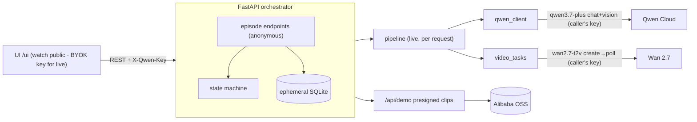

# Circle Take

[](https://github.com/ComBba/circle-take/actions/workflows/ci.yml)
[](LICENSE)


**Bad takes don't make the cut.**

▶️ **Live demo:** https://circle-take-145226765474.us-central1.run.app/ui/ · 🎬 **Video:** https://youtu.be/QZrLzBsiJbo

Circle Take is a self-correcting production loop for generated episodes. It catches broken continuity, reshoots only the failed shot, and remembers only approved takes. Powered by Qwen Cloud.

**Track:** Global AI Hackathon Series with Qwen Cloud — Track 2: AI Showrunner
**License:** MIT

## Status

Anyone can **watch the full loop** with no account. To run **your own** live episode,
bring your own Qwen key (BYOK) — it stays in your browser and powers real Qwen3.7 +
Wan 2.7 generation. Nothing is stored server-side.

| Area | State |
|---|---|
| Orchestrator (state machine + endpoints) | ✅ pytest green, verified in Docker |
| Public Watch-the-loop demo (no key, no account) | ✅ `GET /api/demo` golden path + presigned clips |
| BYOK live: per-request Qwen key (`X-Qwen-Key`) | ✅ used per request, never stored or logged |
| Live Qwen3.7 contracts / Continuity Court | ✅ real Qwen-vision verdict from the generated frame |
| Live Wan 2.7 video gen / reshoot (async per request) | ✅ create→poll; serves the caller's own DashScope URL |
| Storage | ✅ none — no accounts, no keys; ephemeral SQLite |
| Deploy (Cloud Run, single instance) | ✅ `deployment/cloud_run_deploy.md` |

> **How "live" works (honest):** watching the loop is public and key-free. To generate your own
> episode, you pass a Qwen key via `X-Qwen-Key` (kept only in your browser). The server uses it
> **only for that request** — never stored or logged — to make real per-request calls: Qwen3.7 for
> contracts/storyboard, Wan 2.7 for Take 1/Take 2 (async, 1–5 min, polled via `/take/{n}/poll`),
> and Qwen3.7-vision for the Continuity Court verdict on the actual generated frame. The Anchor
> Gate returns `quarantine` when a take doesn't match the contracts — strict, not a rubber stamp.
> With no key, the endpoints replay golden-path fixtures (never presented as live output).

## Demo

The self-contained UI (served at `/ui`) walks the full golden path in the browser — the **CUT** moment is the centerpiece:


## Golden Path

`Brief → Contracts → Storyboard → Take 1 → CUT → Continuity Court verdict → Reshoot (Shot 2 only) → Take Two → Anchor Gate → Red-Thread Memory → Auto Greenlight (Episode 2: "The Delivery Box")`

The signature failure: Luna's red ribbon disappears in Shot 2 and the alarm clock's paper dial turns digital — Qwen catches it, only Shot 2 is reshot, and only the approved take becomes memory.

## Quickstart

### Docker (recommended)

```bash
docker compose up --build
# → http://localhost:8000/health
```

### Local (Python 3.12)

```bash
cd backend
python -m venv .venv && source .venv/bin/activate
pip install -r requirements.txt
uvicorn app.main:app --reload     # http://localhost:8000
```

### Walk the golden path (BYOK)

```bash
B=http://localhost:8000
# Public, no key — the whole walkthrough in one call:
curl -s $B/api/demo
# Or run your own live episode by passing your Qwen key (used per request, never stored):
H='X-Qwen-Key: sk-...'    # your DashScope key
EID=$(curl -s -X POST $B/api/episodes -H 'content-type: application/json' \
  -d '{"title":"The Last Alarm"}' | python -c "import sys,json;print(json.load(sys.stdin)['episode_id'])")
curl -s -X POST $B/api/episodes/$EID/generate -H "$H"     # -> TAKE_1_READY (live: starts Wan Take 1)
curl -s -X POST $B/api/episodes/$EID/take/1/poll -H "$H"  # poll until take_1.status == succeeded
curl -s -X POST $B/api/episodes/$EID/review   -H "$H"     # -> CUT_REQUIRED (real Qwen-vision verdict)
curl -s -X POST $B/api/episodes/$EID/reshoot  -H "$H"     # -> TAKE_2_READY (starts Wan Take 2)
curl -s -X POST $B/api/episodes/$EID/take/2/poll -H "$H"
curl -s -X POST $B/api/episodes/$EID/memory   -H "$H"     # -> AUTO_GREENLIT
curl -s $B/api/episodes/$EID/report                       # full production report
```

Without `X-Qwen-Key` the endpoints replay golden-path fixtures (no Qwen calls).

### Tests

```bash
cd backend && source .venv/bin/activate
pip install -r requirements-dev.txt
python -m pytest -q       # 77 passed, 1 skipped (Postgres roundtrip: set TEST_DATABASE_URL)
```

## Qwen Cloud Usage

| Need | Model (latest, verified) |
|---|---|
| Contracts / storyboard / reasoning | `qwen3.7-plus` (multimodal, GA 2026-06-01) |
| Continuity Court (vision verdict) | `qwen3.7-plus` |
| Establishing / character / frame-control shots | Wan 2.7 — `wan2.7-t2v` / `wan2.7-r2v` / `wan2.7-i2v` |
| Targeted reshoot (edit) | `wan2.7-videoedit` |

Endpoint: `dashscope-intl.aliyuncs.com` (chat: `/compatible-mode/v1`; video: async `video-synthesis` → poll `/tasks/{id}`). See `docs/verified_models.md` and `docs/official_sources.md`.

## Architecture



Deployed on **Google Cloud Run** (single instance, ephemeral SQLite — nothing durable is
stored) — see [`deployment/cloud_run_deploy.md`](deployment/cloud_run_deploy.md). The public
demo clips are presigned from the Alibaba OSS deployment-proof bucket.

Full diagrams (system / state machine / live sequence) + `architecture.png` in [`docs/architecture.md`](docs/architecture.md).
State machine: `DRAFT → CONTRACTED → STORYBOARDED → GENERATING → TAKE_1_READY → REVIEWING → CUT_REQUIRED → RESHOOTING → TAKE_2_READY → ANCHOR_APPROVED → REMEMBERED → AUTO_GREENLIT`.

## Environment Variables

See `.env.example`. Model IDs are centralized there. Live runs use the caller's **BYOK** `X-Qwen-Key` per request (a server `QWEN_API_KEY` is only needed for the offline scripts in `scripts/`); `DATABASE_URL` is ephemeral SQLite; the public demo clips are presigned with `ALIBABA_CLOUD_*`.

## Deployment Proof

See `deployment/alibaba_cloud_proof.md` and `deployment/alibaba_cloud_services.py`.

## License

MIT — see `LICENSE`.
