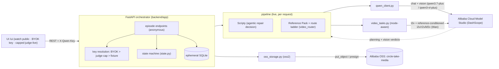
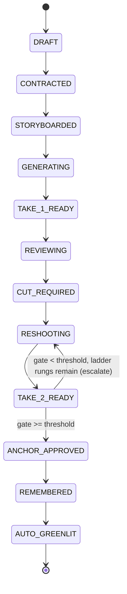
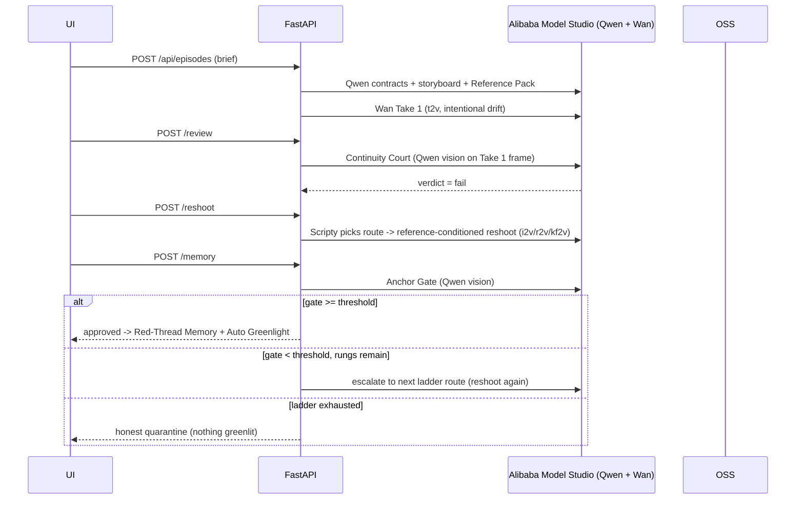

# Circle Take Architecture

Accurate to the built system (GitHub renders the mermaid below). Also see `architecture.png`.

The AI runs on **Alibaba Cloud Model Studio (DashScope)** — Qwen (text + vision) and
Wan / HappyHorse (video) — and media is stored on **Alibaba Cloud OSS**. The single
deployment-proof file is `backend/app/alibaba_cloud_integration.py`.

## System

## Golden-path state machine

## Golden-path sequence (live)

The self-correction loop: the reshoot is **conditioned on a locked reference keyframe**
(Identity-Lock), Scripty **decides** the route, and the Anchor Gate drives
**approve / escalate / quarantine**. Verified live on the free tier: the
reference-conditioned reshoot scored **95/95/95 → approved** (vs. a blind-t2v 15/100
quarantine) — see `docs/evidence/reshoot-spike-2026-06-24.md`.

