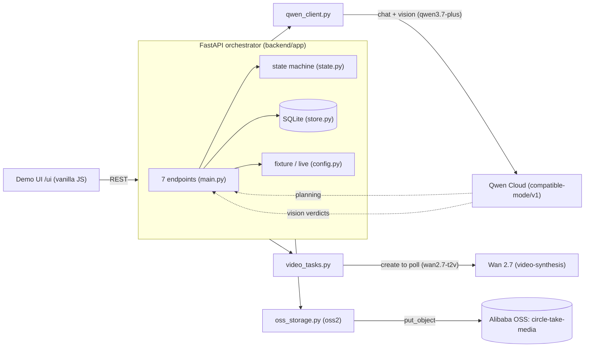
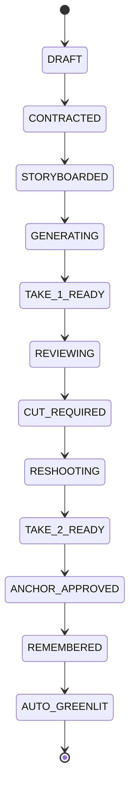
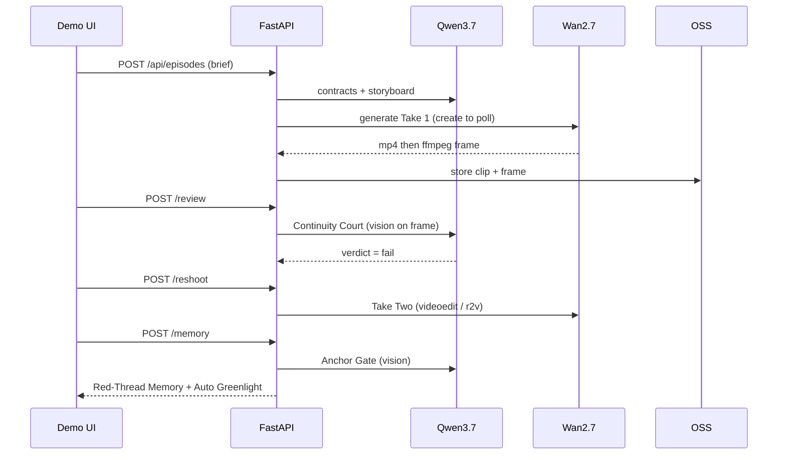

# Circle Take Architecture

Accurate to the built system (GitHub renders the mermaid below). Also see `architecture.png`.

## System

## Golden-path state machine

## Golden-path sequence (live)

